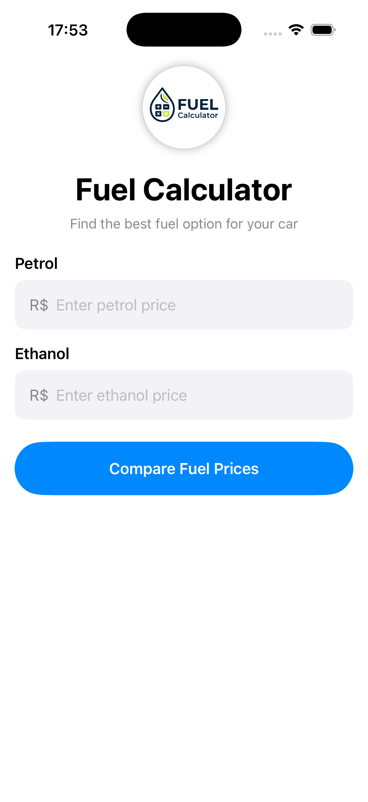
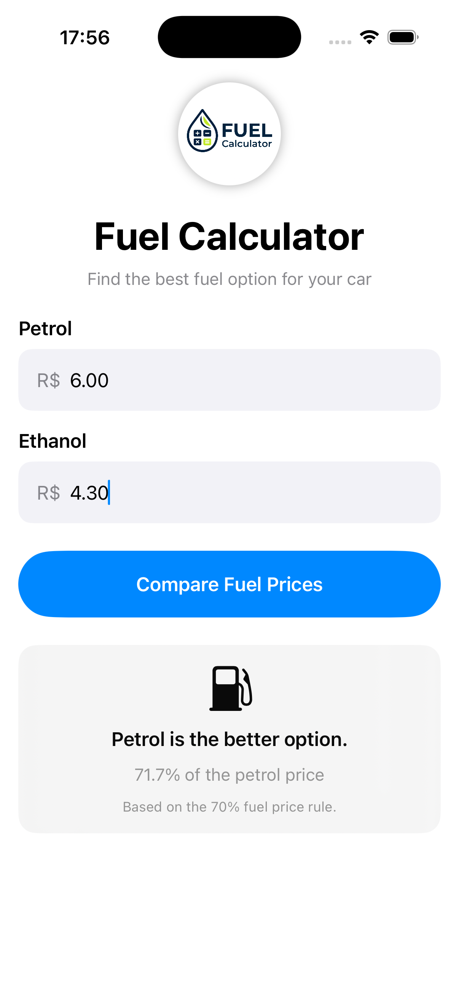
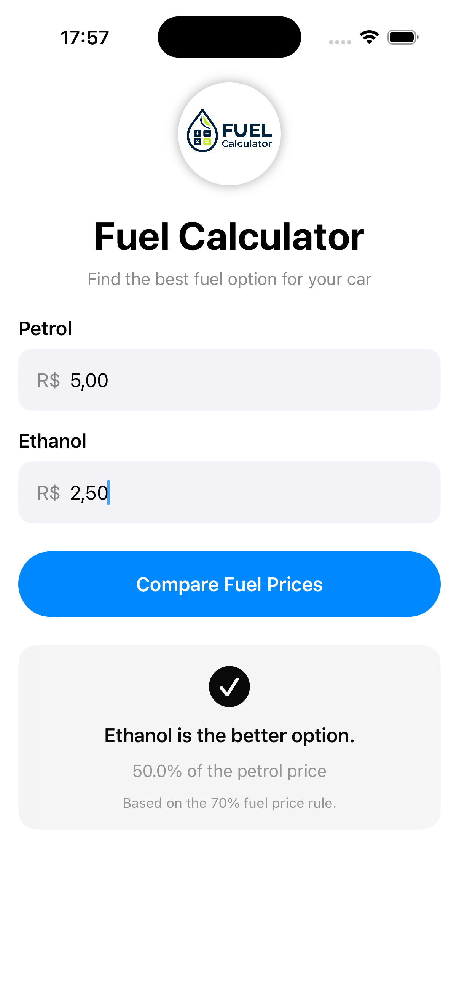

Fuel Calculator

A simple iOS app built with SwiftUI that compares fuel costs between petrol and diesel.

Features

* Calculate the estimated cost of a journey
* Compare petrol and diesel prices
* Display the percentage difference between fuel options
* Simple and user-friendly interface

Technologies

* Swift
* SwiftUI
* Xcode

Project

This project was created as part of my iOS development portfolio to practise SwiftUI, user input handling, calculations, and responsive UI design.

## Screenshots

